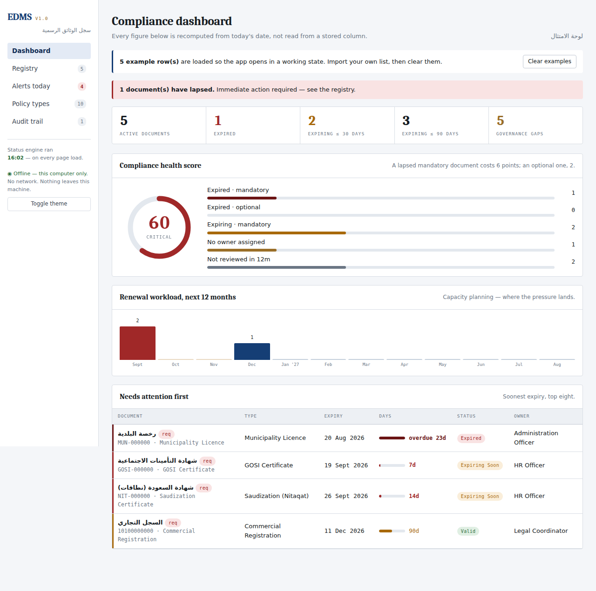
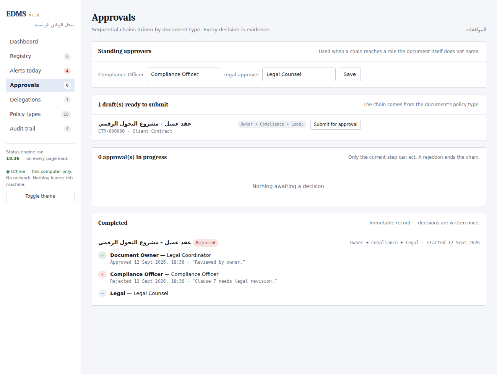
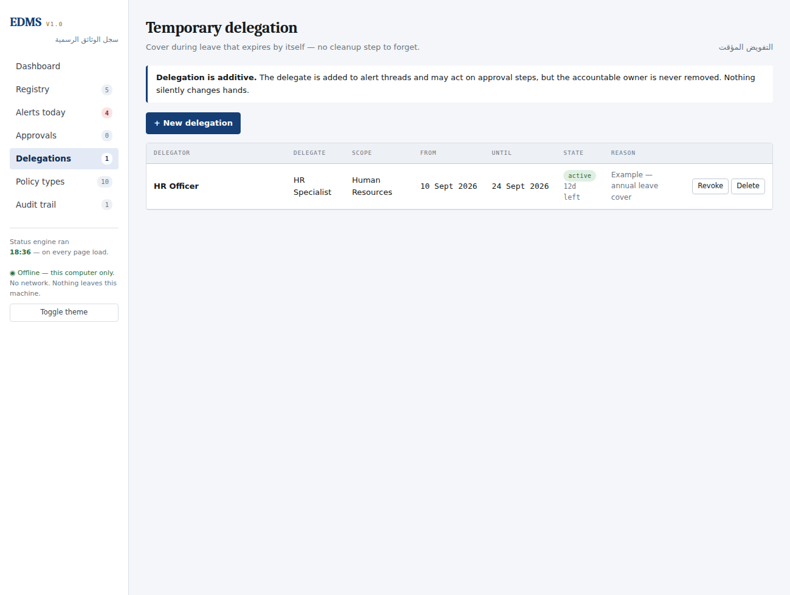

# EDMS — Document Control System
### نظام إدارة الوثائق الرسمية

A document-expiry control system for corporate compliance records — commercial registrations, licences, ISO certificates, insurance policies, bank guarantees. Designed for **SharePoint Online + Power Platform**, with a **working browser application** you can open right now.

**[▶ Open the live app](https://salehmsa.github.io/EDMS-Document-Control/)** · **[Specification](https://salehmsa.github.io/EDMS-Document-Control/docs/blueprint.html)** · **[Deck](https://salehmsa.github.io/EDMS-Document-Control/docs/deck.html)**

> All data in the demo is fictional. No real organisational data is included anywhere in this repository.

---

## Why this exists

A register tells you what you have. A control system tells you what is about to go wrong — and proves it told you.

The trigger was a single broken column. A SharePoint calculated column of the form `ExpiryDate − Today()` **stops evaluating** once the item is written. The value freezes and drifts further from reality every day. Nothing errors. The column quietly lies, and a compliance register that quietly lies is worse than no register at all.

That one defect turned out to be the first of seven.

---

## The seven defects this design prevents

Each has been the root cause of a real document expiry going unnoticed in a SharePoint-based tracker.

| # | Defect | Why it happens | Prevented by |
|---|---|---|---|
| 1 | **The frozen `Today()`** | A calculated column evaluates only on write. It freezes and drifts. | Nightly status engine stamps the value; Power BI recomputes independently and alarms on disagreement. |
| 2 | **Duplicate alert storms** | Recurrence flows double-fire on retries. People filter the sender; the system dies while looking alive. | An idempotency key — `itemId + tier + date` — checked before every send. |
| 3 | **Silent flow death** | A flow is disabled by a licence lapse or a departure. No alert fires, because the thing that fires alerts is what died. | A watchdog flow escalates if no run summary is written within 26 hours. |
| 4 | **Version history explosion** | A nightly job writing every row generates ~1.8M versions a year and destroys `Modified By` as a signal. | Write only where a value actually changed. A correctness requirement, not an optimisation. |
| 5 | **The 5,000-item view threshold** | A list holds 30M items, but any view filtering on an unindexed column fails past 5,000. Works at 200 rows; breaks in production two years later. | Nine indexed columns; every shipped view filters and sorts on one. Verified at 6,000 items. |
| 6 | **Recycle bin as backup** | 93 days of recycle bin is treated as a backup policy until the first purge. | A dedicated backup product with a rehearsed restore drill. |
| 7 | **Item-level permission sprawl** | Breaking inheritance per document degrades badly past ~5,000 unique permissions. | Metadata open; files partitioned by department and sensitivity. Permissions scale with departments, not documents. |

**All seven share one signature: the system keeps looking healthy after it has stopped working.** That is why an automation-health measure sits next to the compliance score on the dashboard.

---

## The working application

`index.html` is a complete, self-contained document registry. One file, no build step, no server, no network calls. Open it and it runs.



**Live status engine** — days-to-expire, status and risk band are recomputed from the clock on every page load. Never stored, never trusted from a cached field. This is defect #1 fixed at the root.

**Escalating alert ladder** — per document type, not a single reminder date. Frequency, audience and channel all widen as expiry approaches: owner → department manager at T-30 → executive sponsor at T-7, where SMS also activates.

**Sequential approval chains** — driven by the document type. One step actionable at a time; rejection terminates the chain and returns the document to draft with a mandatory reason. Decisions are written once and never edited.



**Time-boxed delegation** — cover during leave that expires by itself. Additive by design: the delegate joins alert threads and may act on approval steps, but the accountable owner is never removed.



**Weighted compliance health score** — a single 0–100 figure. A lapsed mandatory document costs 6 points; an optional one, 2. Governance gaps (no owner, no file, no review in 12 months) are weighted too.

**CSV import** — maps an exported SharePoint list automatically, normalises `dd/mm/yyyy` dates, and reports every row it could not read rather than importing it wrong.

### Running it

Download `index.html`, put it in a permanent folder, double-click. That is the whole procedure — no install, no admin rights.

Data is stored in the browser's local storage on that machine only. Use **Save backup** to export a JSON file; local storage is not a backup and the app will remind you.

---

## Repository contents

| Path | What it is |
|---|---|
| `index.html` | The working application — self-contained, offline, ~100 KB |
| `docs/blueprint.html` | Full system specification: architecture, ERD, RBAC, compliance mapping, licence cost calculator |
| `docs/deck.html` | 12-slide executive presentation (arrow keys; `N` for speaker notes; `F` for full screen) |
| `scripts/01-Provision-EDMS.ps1` | Idempotent PnP PowerShell provisioning — 10 lists, columns, lookups, indexes, views, security groups, custom role, seed data |
| `scripts/02-Migrate-OfficialDocuments.ps1` | Dry-run-first migration with date normalisation, lookup auto-provisioning, duplicate guard, throttle back-off, severity-graded exception report |
| `scripts/03-Column-Formatting.json` | SharePoint JSON formatting — status pills, data bars, risk rails, quick actions |
| `flows/FLOW-SPECIFICATIONS.md` | Nine Power Automate flows with exact expressions, the idempotency pattern, recipient resolution, error-handling standard |
| `dax/04-PowerBI-Measures.dax` | 29 DAX measures — health score, governance gaps, coverage gaps, renewal SLA, flow health, RLS |
| `test-plan/05-Test-Plan.md` | 94 test cases across 9 suites with P1/P2/P3 priorities and go/no-go thresholds |

---

## Architecture at a glance

Five layers, with governance running vertically through all of them.

```
CLIENTS       Browser · Teams · Outlook · Mobile · SMS
EXPERIENCE    Indexed list views · Formatted forms · Teams tab · Power BI
AUTOMATION    Status engine · Notifications · Approvals · Renewal · Retention · Watchdog
              └─ PREMIUM LANE: every HTTP flow behind one service account, one licence
DATA          Document registry · 4 reference lists · 5 operational lists · Library

GOVERNANCE    Entra ID · Conditional Access · Sensitivity labels · DLP
(all layers)  Unified Audit Log · Retention labels · Key Vault · Backup
```

### The licensing decision

Flows using only SharePoint, Outlook, Teams and Approvals run on rights **seeded into Microsoft 365**. The moment a flow touches HTTP it becomes premium.

Licensing premium capability per user costs **$36,000/year at 200 users**. Isolating every premium connector behind a single **Power Automate Process** licence costs **$1,800/year** — the licence attaches to the flow, not the person, so unlimited users can trigger it.

That one architectural choice is worth roughly **$34,000 a year**, and it is enforced by a Power Platform DLP policy rather than by good intentions.

---

## Design principles

**Metadata and binaries are separated.** The registry holds the facts everyone needs to see; the library holds files with their own permission surface. This is what lets "everyone can see a valid registration is held" coexist with "only Legal opens the guarantee PDF" — without duplicating rows or breaking inheritance on thousands of items.

**Behaviour is data, not code.** Validity period, reminder ladder, approval chain, retention period and sensitivity tier are attributes of the *document type*. Compliance retunes the system by editing a list row. Nobody opens a flow to change how often a certificate is chased.

**Disposition is never automatic.** Retention expiry proposes a disposition, which is reviewed, approved and logged. Automatic deletion of a record later found to be under legal hold is unrecoverable.

**The shadow run is the acceptance test.** Two weeks in parallel with the legacy register before it is switched off. Zero missed expiries, or no go-live.

---

## Compliance mapping

Built for Saudi regulation first.

- **PDPL** (SDAIA) — 72-hour breach notification runbook, data subject rights routines, write-once audit log, cross-border transfer flagged as a week-1 legal question.
- **ISO 9001:2015 clause 7.5.3** — approval before issue, review dates, version identification, prevention of unintended use of obsolete documents. Each document type carries its clause reference.
- **ISO 27001 Annex A** 5.15, 8.24, 8.15, 8.13 — access control, cryptography, logging, backup.

*Compliance notes summarise publicly available material and are not legal advice.*

---

## Status

Design and prototype complete. The application runs; the provisioning and migration scripts are written and reviewed but have not been executed against a production tenant. The 16-week delivery plan in the specification is a plan, not a deployment history.

---

## Author

**Saleh Mahbub** — Executive Secretary moving into Data & BI Engineering. Riyadh, Saudi Arabia.
Built from a real problem: a compliance register that had outgrown being a register.

Licensed MIT. Use it, fork it, tell me what breaks.
